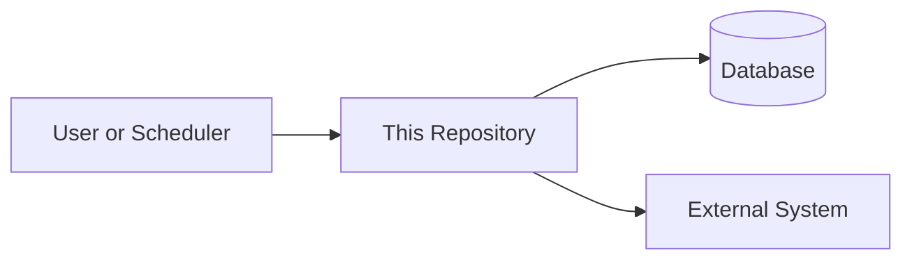
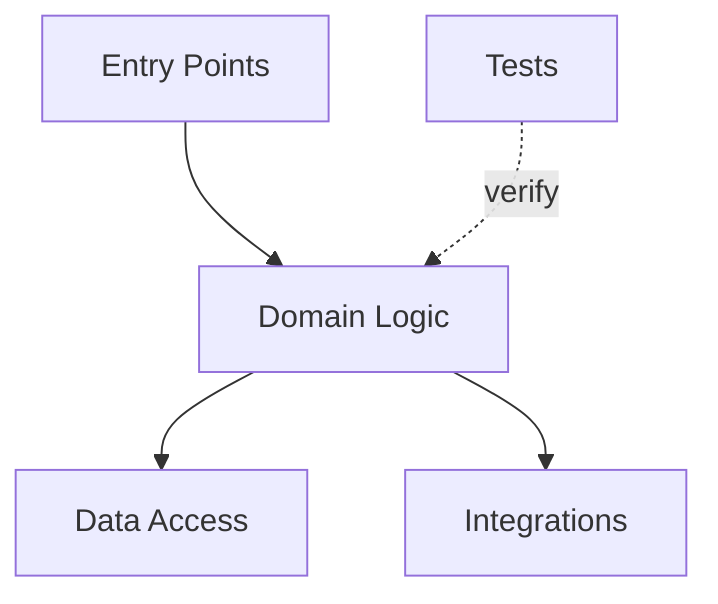
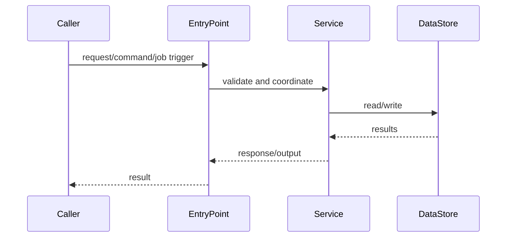
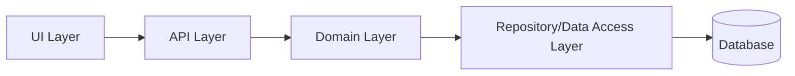
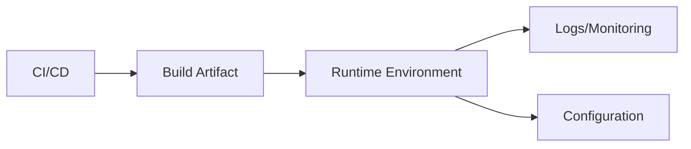

# Architecture Review Checklist for AI-Assisted Code Repositories

**Audience:** senior architects, engineering managers, senior reviewers, accountable human developers  
**Scope:** normal software repositories that may be created, modified, analyzed, or documented with AI coding agents  
**Primary technology assumptions:** Python, SQL, Go, JavaScript, Vue.js, Django, and adjacent build/deployment tooling  
**Review posture:** required standards with pass/fail checks  
**Non-negotiable rule:** AI may assist with analysis, drafting, test generation, and documentation, but all code reviews and architecture approvals are owned by humans.

This checklist is intended to prevent AI-assisted development from turning codebases into black boxes. The main risk is not only bad syntax or missing tests. The larger risk is that an AI agent can miss subtle design decisions, data model assumptions, performance constraints, dependency direction, framework conventions, or historical tradeoffs while producing code that looks clean. This checklist makes those assumptions visible, reviewable, testable, and traceable.

The architecture walkthrough produced by the companion Claude Code skill should create or update:

- `ARCHITECTURE.md`
- `ARCHITECTURE_DIAGRAMS.md`

Those files are review artifacts. They help humans review faster and better, but they do not replace human review.

---

## 1. Required Review Outcomes

Every AI-assisted repository, change, or architecture documentation update must be classified as one of the following:

| Outcome | Meaning |
|---|---|
| **Pass** | Meets the standard. No blocking issue. |
| **Pass with waiver** | A standard is not fully met, but the risk is explicitly accepted by the accountable human reviewer, architect, or manager. The waiver must include reason, owner, expiration or follow-up date, and mitigation. |
| **Fail** | Does not meet the standard. Must not merge until fixed or waived. |
| **N/A** | The standard does not apply. Reviewer must state why. |

A pass means the human reviewer understands the architecture, risk, tests, and operational impact well enough to approve the change. A pass does **not** mean the AI agent produced a persuasive summary.

---

## 2. Minimum Gate Policy

These gates apply to all repositories that contain AI-generated, AI-assisted, or AI-documented code.

| Gate | Pass Criteria | Fail Criteria |
|---|---|---|
| **Human accountability** | A named human developer owns the change and a named human reviewer approves it. | The PR implies the AI agent is responsible, or the change is merged without accountable human review. |
| **Human-only code review** | AI summaries, checklists, and architecture docs are used as aids only. A human reviewer inspects the relevant code paths, tests, and architecture impact. | The reviewer relies on the AI output as the review decision. |
| **Architecture visibility** | The repo has an `ARCHITECTURE.md`, or a documented waiver explaining why it is unnecessary. | Reviewers must infer architecture from scattered files, chat history, tribal knowledge, or agent summaries. |
| **Architecture diagrams when useful** | The repo has an `ARCHITECTURE_DIAGRAMS.md`, or the architecture doc explains why diagrams would add no value. | Important flows, dependencies, or integrations are hard to understand and no visual or text walkthrough exists. |
| **Assumptions are explicit** | Important inferred claims are listed in an assumptions or human-validation section. | The architecture doc states uncertain behavior as fact. |
| **Tests before implementation** | New repositories have acceptance tests defined before implementation. Legacy changes have regression tests or scoped acceptance tests for the changed behavior. | AI-generated implementation appears before any clear verification strategy. |
| **Restricted edit scope** | The PR states exactly which files, folders, or components were intended to change. | The AI agent touched broad areas without prior approval. |
| **Traceability** | For new projects and major features, every business requirement maps to at least one acceptance test and to the code area that implements it. | There is no way to tell why code exists or how behavior is verified. |
| **CI verification** | Relevant tests, linting, type checks, security checks, and architecture-doc verification commands run in CI or are explicitly documented as unavailable. | The reviewer must rely on the agent’s claim that the code works. |
| **Diff reviewability** | The change is small enough to review, or it is split into planned reviewable phases. | The PR mixes unrelated refactors, formatting, feature work, dependency changes, generated code, and documentation drift. |
| **Production safety** | Rollback, migration, configuration, data, and operational impacts are documented when applicable. | The change can affect production behavior without an explicit safety plan. |

---

## 3. Architecture Documentation Standard

The companion Claude Code skill may inspect code, existing technical specifications, business requirements, tests, configuration, deployment files, and documentation. It may ask a short set of human questions to clarify repository familiarity, unclear terms, risky areas, or private/internal libraries.

The generated architecture documentation must be treated as a draft until reviewed by a human.

### 3.1 Required `ARCHITECTURE.md` Sections

`ARCHITECTURE.md` must include the following sections unless explicitly waived.

| Section | Required? | Review Standard |
|---|---:|---|
| **Executive Summary** | Required | States what the repo does, who uses it, the most important architectural idea, and the highest-confidence risks or opportunities. |
| **Repository Purpose** | Required | Explains system type, business capability, users/downstream systems, ownership, and constraints. |
| **Audience Guide** | Required | Provides separate guidance for new developers, managers/business stakeholders, and AI coding agents. |
| **System Context** | Required | Describes upstream systems, downstream systems, databases, APIs, batch inputs/outputs, UI clients, external services, and scheduled jobs. |
| **Main Entry Points** | Required | Lists the main ways execution starts: commands, APIs, jobs, event handlers, UI routes, management commands, tests, or schedulers. |
| **Major Components** | Required | Identifies modules, packages, apps, services, and their responsibilities, dependencies, and important files. |
| **Data and Control Flow** | Required | Explains request, job, command, or data lifecycle, including inputs, transformations, persistence, outputs, errors, and retries when visible. |
| **Runtime, Configuration, and Deployment** | Required | Covers local run commands, test commands, build commands, deployment hints, environment variables, config files, migrations, and operational concerns. |
| **Testing and Verification** | Required | Explains visible unit, integration, acceptance, frontend, SQL, fixture, and verification strategy, including gaps. |
| **How to Navigate the Codebase** | Required | Gives a practical reading order for new developers and reviewers. |
| **Safe Change Guide for Humans and AI Agents** | Required | Identifies files to read before editing, generated files, approval-required areas, test commands, naming conventions, and boundaries. |
| **Assumptions and Items Needing Human Validation** | Required | Lists claims that are inferred, uncertain, or dependent on human knowledge. |
| **Suggested Architecture Improvements** | Required | Recommends practical improvements with senior-developer rationale and manager rationale. May state “No recommendations found” if appropriate. |
| **Glossary** | Required when terms exist | Defines domain terms, acronyms, internal libraries, service names, and abbreviations. May be brief if the repo has no domain-specific terms. |
| **Appendix: Evidence Map** | Required | Maps important architectural claims to files, tests, configs, docs, functions, or commands. |

### 3.2 Required `ARCHITECTURE_DIAGRAMS.md` Sections

`ARCHITECTURE_DIAGRAMS.md` must include Mermaid diagrams when they clarify the repository. Diagrams may be omitted for very small repositories, such as a single script under roughly 200 lines, when a diagram would add noise instead of clarity.

| Section | Required? | Review Standard |
|---|---:|---|
| **Diagram Guidance / Omission Rationale** | Required | Explains whether diagrams are included and why. |
| **System Context Diagram** | Required when useful | Shows users, schedulers, upstream/downstream systems, databases, queues, files, or external services. |
| **Component or Module View** | Required when useful | Shows major packages, apps, modules, layers, or services and their responsibilities. |
| **Request, Job, or Data Flow** | Required when useful | Shows the most important runtime path through the system. |
| **Dependency Direction** | Required when boundaries matter | Shows intended layering or dependency direction and whether the current state is clean, mixed, or unclear. |
| **Runtime and Deployment View** | Required when visible | Shows build, runtime, deployment, configuration, and operations when discoverable. |

### 3.3 Documentation Verification

The repository should include standard-library Python verification for the architecture docs where practical. The verification script should assume Python 3.10.2 and should not require third-party packages.

Minimum verification checks should include:

- `ARCHITECTURE.md` exists when required.
- `ARCHITECTURE_DIAGRAMS.md` exists when required.
- Required architecture sections are present or explicitly waived.
- Mermaid code fences are balanced when diagrams are present.
- Evidence map exists and contains at least one concrete file/config/test reference for non-trivial repositories.
- Assumptions section exists.
- Suggested improvements section exists.
- Safe-change guidance exists.

Example command:

```bash
python3 verify_architecture_docs.py
```

---

## 4. AI-Assisted Architecture Discovery Standard

AI may assist in creating architecture documentation, but the process must make uncertainty visible.

### A1. The AI architecture pass must start with a light human interview.

**Standard:** Before deep analysis, the agent asks how familiar the human is with the repository: none, some, or very familiar.

**Pass checks:**
- If the user knows nothing, the agent proceeds with a beginner-first walkthrough.
- If the user has some familiarity, the agent asks at most two targeted questions about focus area and audience.
- If the user is very familiar, the agent asks at most three targeted questions about confusing areas, risky areas, internal terms, generated files, private libraries, or desired emphasis.
- If analysis reveals blockers, the agent asks up to three additional clarification questions.

**Fail checks:**
- The agent asks a long interview before doing useful work.
- The agent assumes private/internal library behavior without marking uncertainty.
- The final doc hides unresolved questions.

**Why needed:** A small amount of human context can prevent a polished but wrong architectural story.

### A2. The architecture document must distinguish fact, inference, and unknowns.

**Standard:** Claims must be grounded in repo evidence or explicitly marked as assumptions.

**Pass checks:**
- High-confidence claims cite files, tests, configs, routes, functions, schemas, or docs in the evidence map.
- Medium-confidence claims explain the convention or structure that supports the inference.
- Low-confidence claims appear in the assumptions section.

**Fail checks:**
- The doc says “the system does X” when the code only weakly implies it.
- The doc invents business rules or operational behavior.
- The assumptions section is empty despite unclear code or missing docs.

**Why needed:** AI agents can produce plausible architecture narratives. Reviewers need to know which claims are proven.

### A3. Existing specifications and business requirements must be reconciled with the code.

**Standard:** When a technical specification, business requirement, issue, or design note exists, the architecture review must compare it to the implemented code and tests.

**Pass checks:**
- Requirements are mapped to entry points, components, workflows, and tests.
- Missing, ambiguous, or contradicted requirements are called out.
- Code that exists without a visible requirement is flagged for human review.

**Fail checks:**
- The architecture doc only summarizes code structure and ignores the stated requirement.
- The agent assumes the implementation is correct because it is present.
- Reviewers cannot tell whether the system solves the requested business problem.

**Why needed:** A codebase can be internally consistent and still implement the wrong design.

---

## 5. Repository-Level Architecture Heuristics

Each heuristic includes a required standard, pass/fail check, and why the rule exists.

### H1. The repository must have a clear purpose, scope, and owner.

**Standard:** The repo must state what business or technical capability it owns, what it does not own, and who is accountable for it.

**Pass checks:**
- `README.md` or `ARCHITECTURE.md` states the repo’s purpose in plain language.
- Ownership is clear: team, support channel, code owners, or review group.
- Out-of-scope responsibilities are documented when confusion is likely.

**Fail checks:**
- The repo is a vague “utility,” “common,” “platform,” or “service” with no bounded purpose.
- Multiple developers add unrelated behavior because there is no stated ownership boundary.

**Why needed:** AI coding agents rely heavily on local context. A clear purpose helps the agent avoid inventing responsibilities or editing unrelated areas.

### H2. The repo must contain an architecture walkthrough aligned with the standard template.

**Standard:** `ARCHITECTURE.md` must explain the system well enough for a new senior engineer, manager, and AI coding agent to understand the purpose, workflows, risks, and safe edit boundaries.

**Pass checks:**
- Required architecture sections are present or waived.
- A reviewer can identify where to make a likely change without reading the whole codebase.
- Protected areas are explicitly named.
- The file is updated when architecture changes.
- The evidence map links important claims to repo evidence.

**Fail checks:**
- Architecture exists only in people’s heads or chat history.
- The only documentation is generated API docs or a file-by-file inventory.
- The doc is stale and contradicts the code.
- The doc lacks assumptions, safe-change guidance, or evidence.

**Why needed:** AI agents often over-read or under-read the codebase. A concise architecture walkthrough provides high-signal context and reduces blind edits.

### H3. Important diagrams or visual walkthroughs must exist when they reduce review risk.

**Standard:** `ARCHITECTURE_DIAGRAMS.md` must include small, readable Mermaid diagrams when they clarify system context, components, workflows, dependency direction, or runtime model.

**Pass checks:**
- Diagrams are grounded in code, config, docs, or tests.
- Diagrams are small enough to review.
- Text explains what each diagram proves and what remains uncertain.
- Diagram omission is justified for small or simple repos.

**Fail checks:**
- Diagrams invent systems, dependencies, or data flows not supported by evidence.
- A complex system has no visual or structured walkthrough.
- One unreadable diagram tries to show the entire system.

**Why needed:** Visuals help reviewers and managers understand architecture faster, but inaccurate diagrams are worse than no diagrams.

### H4. The architecture must expose critical design assumptions and invariants.

**Standard:** Non-obvious rules that make the design correct must be documented, tested, or both.

**Pass checks:**
- Critical data model assumptions are documented, such as primary keys, uniqueness, ordering, idempotency, transaction boundaries, and indexing expectations.
- Performance-sensitive algorithms or queries have tests, benchmarks, query plans, or documented constraints when appropriate.
- Framework conventions that affect correctness are named.
- Human reviewers can explain why the chosen design is correct.

**Fail checks:**
- A key correctness rule is only implicit in code structure.
- An AI port, rewrite, or refactor changes data access patterns without proving equivalent behavior or performance.
- Reviewers cannot identify the assumptions that would make the design fail.

**Why needed:** AI-generated code can preserve surface behavior while missing the subtle design constraint that made the original system correct or fast.

### H5. The architecture must have bounded contexts and explicit module boundaries.

**Standard:** Each major component must have a clear responsibility and a narrow public interface.

**Pass checks:**
- Modules are organized around business capability or technical responsibility.
- Internal implementation details are not imported across unrelated areas.
- Shared code is small, stable, and intentionally designed.
- Names reveal ownership and purpose.

**Fail checks:**
- Large `common`, `shared`, `helpers`, or `utils` modules become dumping grounds.
- A feature requires edits across many unrelated modules.
- Components reach into each other’s private data structures.

**Why needed:** Clear boundaries reduce the blast radius of AI edits and make human review realistic.

### H6. Dependency direction must be clear and enforceable.

**Standard:** The repo must have an intentional dependency direction, such as interface → domain → application → infrastructure, UI → API → domain → persistence, or another documented layering model.

**Pass checks:**
- High-level business logic does not depend directly on low-level infrastructure details unless intentionally documented.
- Cross-layer dependencies are minimal and justified.
- Circular dependencies are absent or explicitly waived with a migration plan.
- Forbidden imports or coupling patterns are documented where useful.

**Fail checks:**
- Business logic imports database clients, HTTP clients, UI widgets, environment readers, and framework globals throughout the codebase.
- Circular dependencies make it hard to test or change one area safely.

**Why needed:** AI agents tend to copy nearby patterns. If dependency direction is messy, the agent will multiply the mess.

### H7. Side effects must be isolated at boundaries.

**Standard:** File I/O, network calls, database writes, message publishing, clock access, random generation, environment access, and external process execution should be isolated behind narrow interfaces.

**Pass checks:**
- Core logic can be tested without real infrastructure.
- Side effects are easy to mock, fake, or run against a test fixture.
- External calls have timeouts, error handling, and observability.

**Fail checks:**
- Business logic performs direct database writes, filesystem changes, environment reads, and network calls inline.
- Tests require live infrastructure for normal behavior checks.

**Why needed:** Isolating side effects makes behavior easier to verify and prevents accidental production-impacting changes.

### H8. Core business rules must be deterministic and testable.

**Standard:** Core decisions must be represented as deterministic code, not hidden in incidental control flow, prompt text, runtime state, or implicit framework behavior.

**Pass checks:**
- Business rules are named and tested directly.
- Time, randomness, external data, and environment values are injected or controlled in tests.
- Important decision tables, state transitions, or edge cases are documented.

**Fail checks:**
- Reviewers cannot tell where a business rule lives.
- Important behavior depends on current time, external state, or global configuration without test control.

**Why needed:** Deterministic core logic gives both humans and AI agents a stable target for changes and regression tests.

### H9. Public interfaces must be explicit contracts.

**Standard:** APIs, CLI commands, event payloads, database-facing DTOs, SQL result shapes, UI route contracts, and external integration boundaries must have explicit schemas, types, validators, or documented contracts.

**Pass checks:**
- Inputs and outputs are typed, validated, or schema-defined.
- Backward compatibility expectations are documented.
- Invalid inputs fail clearly.
- SQL result expectations and key columns are visible where important.

**Fail checks:**
- Any dictionary, map, JSON object, SQL row, or dynamic structure can contain anything.
- Callers rely on undocumented fields or side effects.

**Why needed:** AI agents are likely to pass plausible but wrong shapes unless contracts are explicit.

### H10. Configuration and secrets must be separate from code and validated at startup.

**Standard:** Runtime configuration must be centralized, typed or schema-validated, documented, and separated from secrets.

**Pass checks:**
- Required settings are documented with safe examples.
- Missing or invalid settings fail fast.
- Secrets are never hardcoded.
- Environment-specific values are outside source code.
- Secrets-handling mechanism is identified without exposing secret values.

**Fail checks:**
- Configuration is scattered across modules.
- Defaults silently point to production or unsafe resources.
- Secrets, credentials, tokens, or private endpoints are committed.

**Why needed:** Configuration mistakes are a common class of production bugs, and AI agents frequently infer configuration patterns from local examples.

### H11. The test strategy must match the architecture.

**Standard:** The repo must define which behavior is covered by unit tests, integration tests, acceptance tests, contract tests, frontend tests, SQL checks, performance checks, and manual checks.

**Pass checks:**
- Core logic has fast deterministic tests.
- Integration boundaries have contract or fixture-based tests.
- New repositories define acceptance tests before implementation.
- Legacy changes add regression tests scoped to the changed behavior.
- Performance-sensitive behavior has an appropriate performance guard or documented waiver.

**Fail checks:**
- Most tests are broad end-to-end tests that are slow, flaky, or hard to diagnose.
- No test directly proves the changed behavior.
- The agent claims “all tests pass” without showing what ran.

**Why needed:** Architecture and testing are inseparable. Testability is the main safety control for AI-assisted coding.

### H12. Requirements must be traceable to acceptance tests and code.

**Standard:** For new repositories and major features, each requirement must map to:

1. acceptance test,
2. implementation component,
3. reviewer-visible evidence.

**Pass checks:**
- A traceability table exists in the plan, PR, architecture doc, or test documentation.
- Each acceptance test has a clear requirement.
- Dead or speculative code is not introduced.

**Fail checks:**
- Code exists because the AI agent predicted it might be useful.
- Tests verify implementation details but not stated behavior.

**Why needed:** Traceability prevents AI agents from adding plausible but unnecessary code and gives managers confidence that delivered code maps to requested outcomes.

### H13. New repositories must be plan-reviewed before implementation.

**Standard:** A new repository must have an approved architecture and test plan before significant implementation begins.

**Pass checks:**
- Plan includes repo purpose, boundaries, modules, dependencies, acceptance tests, CI, deployment model, operational risks, and architecture documentation plan.
- Architect or senior reviewer resolves blocking issues before coding starts.
- The implementation follows the approved plan or records a decision change.

**Fail checks:**
- The agent scaffolds a repo and architecture after the fact.
- A large generated codebase is presented as “mostly done” before review.

**Why needed:** AI agents can generate a lot of code quickly. Plan review prevents a team from inheriting a large wrong structure.

### H14. Legacy repositories must be improved incrementally.

**Standard:** For legacy repos, each AI-assisted change should make the touched area slightly safer without requiring a broad refactor.

**Pass checks:**
- The change is minimal and focused.
- Tests are added around changed behavior.
- Any cleanup is local and necessary for the change.
- The PR notes one optional future improvement if a larger refactor is needed.
- `ARCHITECTURE.md` or `ARCHITECTURE_DIAGRAMS.md` is updated when the change reveals durable architecture knowledge.

**Fail checks:**
- The AI agent rewrites architecture to satisfy ideal guidelines.
- The PR mixes bug fix, redesign, formatting, dependency upgrades, and unrelated cleanup.
- Reviewers cannot tell which changes are required.

**Why needed:** Large refactors in legacy systems increase risk. The goal is continuous architecture improvement, not architecture theater.

### H15. Edit scopes must be restricted and reviewed.

**Standard:** Every AI-assisted task must declare an intended edit scope before code changes.

**Pass checks:**
- The scope lists files, folders, modules, or components that may change.
- Protected areas require explicit approval.
- The final diff explains any scope expansion.

**Fail checks:**
- The agent edits files outside the requested area without explanation.
- Generated changes include broad formatting, renames, migrations, or dependency upgrades not requested.

**Why needed:** Restricted edit scopes reduce accidental damage and make human review realistic.

### H16. Architecture decisions must be recorded when difficult to reverse.

**Standard:** Significant decisions should be captured in ADRs or an equivalent decision log.

**Pass checks:**
- ADRs include context, decision, alternatives considered, consequences, owner, and date.
- Superseded decisions are linked, not silently rewritten.
- Decisions are near the code or linked from `ARCHITECTURE.md`.

**Fail checks:**
- Reviewers cannot tell why a framework, database, messaging pattern, service boundary, or data model was chosen.
- The agent changes architecture without recording the reason.

**Why needed:** AI agents cannot infer historical tradeoffs. Decision records prevent accidental reversal of important choices.

### H17. Human review must focus on architecture, behavior, security, and operability.

**Standard:** Human review must not be reduced to checking whether the AI-generated diff “looks fine.”

**Pass checks:**
- Reviewer checks behavior against acceptance tests.
- Reviewer checks architectural boundaries and dependency direction.
- Reviewer checks security, data handling, rollback, and operations when relevant.
- Reviewer challenges unnecessary abstractions or speculative code.
- Reviewer inspects high-risk code paths rather than relying only on the AI summary.

**Fail checks:**
- Review consists only of style comments.
- The reviewer relies on the agent’s summary without reading important code paths.

**Why needed:** AI-generated code can be syntactically polished while being semantically wrong.

### H18. CI must be fast enough to be used on every change.

**Standard:** The repo must have a reliable verification path that runs automatically or with documented commands.

**Pass checks:**
- There are commands for fast local checks and full CI checks.
- CI includes tests, linting/formatting, type checks where applicable, security/dependency checks where available, and architecture-doc checks where applicable.
- Flaky tests are tracked and not ignored.

**Fail checks:**
- Verification depends on a developer’s workstation.
- CI is so slow or flaky that teams routinely bypass it.

**Why needed:** AI-assisted development increases code throughput. Verification must scale with that throughput.

### H19. Observability and failure modes must be designed, not added later.

**Standard:** Production-facing code must expose enough logs, metrics, traces, alerts, and error messages to diagnose failures.

**Pass checks:**
- Important workflows have meaningful structured logs or equivalent diagnostics.
- Errors preserve context without leaking secrets or sensitive data.
- Retry, timeout, fallback, partial-failure, and rollback behavior is documented where relevant.

**Fail checks:**
- The only signal is a generic exception or failed job.
- New behavior can fail silently.
- Logs expose secrets, PII, tokens, or confidential data.

**Why needed:** AI-generated code may handle the happy path well but miss operational edge cases.

### H20. Security boundaries must be explicit.

**Standard:** Authentication, authorization, secrets, input validation, output encoding, SQL construction, shell execution, and data access boundaries must be visible and testable.

**Pass checks:**
- Sensitive operations check authorization at the boundary.
- Inputs from users, files, APIs, messages, and databases are validated or safely parsed.
- Secrets are handled through approved mechanisms.
- Security-sensitive changes get a knowledgeable human reviewer.

**Fail checks:**
- The agent creates new access paths without authorization checks.
- Unsafe string interpolation, shell execution, dynamic eval, or SQL construction is introduced.
- Sensitive data is logged or copied to test fixtures.

**Why needed:** Security bugs are often logic and boundary bugs, not just syntax issues detectable by tools.

### H21. Data ownership and data flow must be understandable.

**Standard:** The architecture must explain where important data originates, how it is transformed, where it is stored, and who owns it.

**Pass checks:**
- Data flow is documented for important workflows.
- Data transformations are named and tested.
- Data retention, classification, and access assumptions are documented when relevant.
- Primary keys, indexes, uniqueness, ordering, idempotency, and transaction assumptions are documented when important.

**Fail checks:**
- Data is copied between layers or services without clear ownership.
- Transformations are hidden in ad hoc scripts, callbacks, or deeply nested code.
- A rewrite changes data access patterns without proving equivalent behavior or performance.

**Why needed:** AI agents often make local changes without understanding downstream data impact.

### H22. Dependencies must be intentional and reviewed.

**Standard:** New runtime dependencies, frameworks, services, packages, and infrastructure integrations require explicit justification.

**Pass checks:**
- PR explains why the dependency is needed and why existing code cannot satisfy the need.
- Licensing, maintenance, security, and operational impact are considered.
- Dependency versioning is pinned or controlled according to team practice.

**Fail checks:**
- The agent adds a package because it is common online.
- A small feature pulls in a large framework.
- Multiple libraries solve the same problem in the same repo.

**Why needed:** AI agents are prone to choosing familiar libraries even when they are unnecessary or disallowed.

### H23. Generated code must be minimized and isolated.

**Standard:** Generated code should be clearly marked, reproducible, and separated from hand-edited code where possible.

**Pass checks:**
- Generation command, source schema, and regeneration instructions are documented.
- Generated files are excluded from manual edits or clearly labeled.
- Reviewers focus on generator inputs where possible.

**Fail checks:**
- Generated code is hand-edited without a strategy.
- The agent modifies generated output instead of the source definition.

**Why needed:** AI agents may edit generated artifacts that will be overwritten, creating false confidence.

### H24. The repository must avoid speculative abstraction.

**Standard:** Abstractions must be justified by current requirements, not imagined future use.

**Pass checks:**
- Interfaces exist to isolate real volatility or support testing.
- Generic frameworks are avoided unless they remove real complexity.
- Dead extension points are removed.

**Fail checks:**
- The agent creates factories, plugin systems, base classes, and registries for one implementation.
- Code is harder to trace because of abstractions that have no current use.

**Why needed:** AI-generated code often overgeneralizes because generalized patterns appear frequently in training data.

### H25. The architecture must support safe deletion.

**Standard:** Code should be organized so unused features, modules, tests, and dependencies can be identified and removed safely.

**Pass checks:**
- Feature entry points and ownership are clear.
- Tests fail when important behavior is removed.
- Dead code is not kept “just in case.”

**Fail checks:**
- Reviewers cannot tell whether a module is used.
- The agent preserves obsolete code because it cannot infer deletion safety.

**Why needed:** AI agents are usually better at adding code than safely removing it. Architecture should make deletion reviewable.

### H26. Error handling must be part of the design.

**Standard:** Expected failure modes must be represented in code, tests, and documentation.

**Pass checks:**
- User errors, integration failures, invalid inputs, timeouts, partial failures, retries, and rollback behavior are handled intentionally.
- Tests cover at least the main failure paths.
- Errors are actionable for operators or callers.

**Fail checks:**
- Exceptions are swallowed.
- Errors are converted into ambiguous `false`, `null`, `None`, or empty collections without context.
- The agent only tests the happy path.

**Why needed:** Production bugs often occur at boundaries and failure paths, which AI agents may under-specify unless required.

### H27. Performance-sensitive behavior must have explicit review evidence.

**Standard:** If the change affects algorithmic complexity, query shape, indexes, caching, batching, concurrency, serialization, or hot paths, the PR must include performance evidence or a documented waiver.

**Pass checks:**
- Relevant benchmarks, query plans, profiling output, load tests, or complexity analysis are provided when needed.
- Data size assumptions are documented.
- Key database access patterns are reviewed by a human who understands the domain.
- Performance-sensitive rewrites prove equivalence against the previous behavior.

**Fail checks:**
- The agent ports, rewrites, or refactors performance-sensitive code without proving equivalent behavior and acceptable performance.
- A query, loop, cache, primary key, or index assumption changes silently.
- Reviewers cannot tell whether the code is correct at expected data volumes.

**Why needed:** A design can be functionally correct on small examples while being fundamentally wrong at production scale.

### H28. The PR must include an AI change summary.

**Standard:** Every AI-assisted PR should include a concise summary that helps reviewers focus.

**Required fields:**
- Human owner
- AI assistance used: yes/no
- Requirement or issue link
- Intended edit scope
- Files changed and why
- Acceptance/regression tests added or updated
- Commands run
- Architecture documentation updated or waived
- Known risks and assumptions
- Areas intentionally not changed
- Required human review focus

**Pass checks:**
- Reviewer can reconstruct the change intent from the PR.
- The summary matches the actual diff.
- The summary identifies risky or nuanced areas instead of hiding them.

**Fail checks:**
- The PR only says “implemented feature” or “fixed bug.”
- The summary hides risky generated changes.

**Why needed:** Reviewers need a map. AI agents can produce large diffs quickly; the summary makes review targeted and accountable.

---

## 6. New Repository Review Checklist

A new AI-assisted repository must not pass architecture review unless the following are present or waived.

| Check | Pass / Fail / Waiver Notes |
|---|---|
| Repository purpose, scope, out-of-scope responsibilities, and ownership are clear. |  |
| Business requirements or technical specification are linked or included. |  |
| Requirements are mapped to acceptance tests and implementation areas. |  |
| `ARCHITECTURE.md` exists before broad implementation. |  |
| `ARCHITECTURE_DIAGRAMS.md` exists or a diagram omission rationale is documented. |  |
| Architecture doc includes all required sections. |  |
| Evidence map links important claims to files, tests, configs, or docs. |  |
| Assumptions and human-validation items are documented. |  |
| Acceptance tests are defined before implementation. |  |
| Major modules and dependency direction are documented. |  |
| Main entry points and core workflows are documented. |  |
| External integrations and data flows are documented. |  |
| Data ownership, keys, indexes, transaction assumptions, and persistence model are documented where relevant. |  |
| Configuration and secrets model is documented. |  |
| CI commands and local verification commands are documented. |  |
| Python 3.10.2 standard-library architecture-doc verification command exists or is waived. |  |
| Security-sensitive paths are identified. |  |
| Operational risks, logging, monitoring, alerting, and rollback are considered. |  |
| Performance-sensitive paths have evidence or are marked N/A. |  |
| ADRs exist for hard-to-reverse decisions. |  |
| Safe-to-edit and approval-required areas are named. |  |
| Human reviewer and accountable owner are identified. |  |

---

## 7. Legacy Repository Change Checklist

A legacy AI-assisted change should be reviewed differently from a new repository.

| Check | Pass / Fail / Waiver Notes |
|---|---|
| The change is scoped to the requested behavior. |  |
| The PR avoids broad refactoring unless explicitly approved. |  |
| Regression tests or scoped acceptance tests cover the changed behavior. |  |
| Existing patterns are followed unless the PR explains why not. |  |
| The touched area becomes slightly easier to understand, test, or safely change. |  |
| `ARCHITECTURE.md` is added or updated when the change reveals durable architecture knowledge. |  |
| `ARCHITECTURE_DIAGRAMS.md` is added or updated when the change affects diagrams or important flows. |  |
| Assumptions and open questions are updated when the change depends on inferred behavior. |  |
| Protected files, schemas, migrations, generated files, deployment files, and secrets/config files are not modified without approval. |  |
| Risky data model, query, index, primary-key, transaction, or performance assumptions are called out. |  |
| Reviewer can understand why every changed file was touched. |  |
| Follow-up refactor ideas are separated from the current change. |  |

---

## 8. Human Review Focus Checklist

Use this section during code review. AI may generate a draft response, but the human reviewer owns the decision.

| Focus Area | Human Reviewer Question |
|---|---|
| **Behavior** | Does the code implement the stated requirement, not just a plausible interpretation? |
| **Architecture** | Does the change respect the documented boundaries, dependency direction, and safe-edit guidance? |
| **Nuance** | Are there subtle data, performance, framework, ordering, transaction, or integration assumptions that the AI may have missed? |
| **Tests** | Do the tests prove the behavior at the right level, including acceptance or regression coverage? |
| **Failure modes** | What happens on invalid input, partial failure, timeout, empty data, duplicate data, or dependency failure? |
| **Security** | Are auth, authorization, input validation, secrets, SQL construction, shell execution, and data handling safe? |
| **Operations** | Can this be deployed, observed, rolled back, and diagnosed? |
| **Reviewability** | Is the diff small and focused enough for meaningful human review? |
| **Docs** | Did architecture docs, diagrams, assumptions, and safe-change notes change when architecture knowledge changed? |

---

## 9. Anti-Patterns: What Not To Do

| Anti-Pattern | Why It Is Dangerous | Review Action |
|---|---|---|
| **AI-generated large-bang rewrite** | High defect risk, hard to review, often changes behavior accidentally. | Fail unless explicitly approved as a migration with phased review. |
| **Architecture only in chat history** | Future humans and agents cannot recover the reasoning. | Require repo documentation or ADR. |
| **AI-generated architecture doc accepted without human validation** | The doc may sound right while hiding wrong assumptions. | Require human review of evidence, assumptions, and key flows. |
| **No tests because the change is “obvious”** | Obvious changes still break production behavior. | Require regression or acceptance test, or documented waiver. |
| **Agent edits outside scope** | Increases blast radius and hides unrelated behavior changes. | Fail or split into separate PR. |
| **Formatting mixed with behavior change** | Makes review harder and hides defects. | Split formatting into separate PR. |
| **Generic `utils` dumping ground** | Destroys ownership and encourages copy/paste reuse. | Require domain-specific home or small explicit module. |
| **Hidden global state** | Makes behavior order-dependent and tests unreliable. | Require dependency injection, explicit context, or documented boundary. |
| **Direct infrastructure calls from core logic** | Makes business rules hard to test and easy to break. | Move side effects behind boundary interfaces. |
| **Speculative framework or plugin system** | Adds complexity without current value. | Remove unless justified by real requirements. |
| **Dependency added without review** | Adds security, licensing, maintenance, and operational risk. | Require dependency justification. |
| **Generated code manually edited** | Changes may disappear on regeneration. | Edit the source definition or document exception. |
| **No architecture walkthrough** | Agents and new reviewers must infer too much. | Require `ARCHITECTURE.md` or waiver. |
| **No diagrams for complex flows** | Reviewers may miss system boundaries, integrations, or data movement. | Require `ARCHITECTURE_DIAGRAMS.md` or omission rationale. |
| **Prompt-dependent behavior** | Code depends on instructions that are not versioned with the repo. | Move durable rules into docs, tests, schemas, or code. |
| **Untyped dynamic payloads everywhere** | AI agents pass plausible but wrong shapes. | Add schemas, typed DTOs, validators, or contract tests. |
| **Only happy-path tests** | Boundary and failure bugs survive review. | Add negative and edge-case tests. |
| **Silent error handling** | Production failures become invisible or misleading. | Require actionable errors and observability. |
| **“Trust the agent” review** | AI code can look polished while being wrong. | Human reviewer must inspect behavior, tests, security, and architecture. |
| **Stale documentation** | Misleads agents and reviewers. | Update docs in the same PR or mark stale sections. |
| **Multiple ways to do the same thing** | Agents choose inconsistently and create drift. | Consolidate or document preferred pattern. |
| **Architecture purity refactor in legacy code** | Increases short-term production risk. | Require incremental, scoped improvement. |
| **Performance-sensitive rewrite without evidence** | The code may pass small tests while failing at production scale. | Require benchmark, query plan, profiling, or explicit waiver. |
| **Implicit data model assumptions** | Wrong keys, indexes, ordering, uniqueness, or transaction assumptions can invalidate the design. | Document and test the assumptions. |

---

## 10. Recommended `ARCHITECTURE.md` Template

```markdown
# Architecture Walkthrough

> This document explains the repository for new developers, managers, and AI coding agents. It should describe the current architecture as it exists today, not an idealized version.

## 1. Executive Summary

Briefly explain:

- what this repository does
- who uses it
- what business or technical capability it supports
- the most important architectural idea to understand first
- the highest-confidence risks or improvement opportunities

## 2. Repository Purpose

Describe the repository in plain language.

Include:

- system type: app, service, library, batch job, report, frontend, backend, data pipeline, monorepo, or mixed
- primary users or downstream systems
- business capability
- important constraints

## 3. Audience Guide

### For New Developers

Explain what they should read first and what they should ignore at first.

### For Managers and Business Stakeholders

Explain value, ownership, risk, operational shape, and support burden without implementation-heavy language.

### For AI Coding Agents

Explain the safest way to navigate and modify the repository.

## 4. System Context

Describe how this repository fits into the larger ecosystem.

Include known or inferred:

- upstream systems
- downstream systems
- databases
- APIs
- batch inputs and outputs
- UI clients
- external services
- scheduled jobs

See `ARCHITECTURE_DIAGRAMS.md` for diagrams.

## 5. Main Entry Points

List the main ways code execution starts.

| Entry Point | Type | Purpose | Evidence | Confidence |
|---|---|---|---|---|
| `path/to/file` | CLI/API/job/UI/test | What starts here | File, function, config, route, command | High/Medium/Low |

## 6. Major Components

Explain the major modules, packages, apps, or services.

| Component | Responsibility | Important Files | Depends On | Notes |
|---|---|---|---|---|
| Component name | What it owns | `path` | Other components/systems | Key facts |

## 7. Data and Control Flow

Explain the normal flow through the system.

Include:

- request lifecycle, job lifecycle, or command lifecycle
- data inputs
- transformations
- persistence
- outputs
- error handling
- retries or recovery behavior when visible

## 8. Runtime, Configuration, and Deployment

Explain how the system runs.

Include:

- local development commands
- test commands
- build commands
- deployment hints
- environment variables
- config files
- database migrations
- operational concerns

## 9. Testing and Verification

Explain the test strategy visible in the repo.

Include:

- unit tests
- integration tests
- acceptance tests
- frontend tests
- SQL validation
- fixture strategy
- commands to run
- gaps or missing verification

## 10. How to Navigate the Codebase

Give a practical reading order.

## 11. Safe Change Guide for Humans and AI Agents

Explain how to make changes safely.

Include:

- files to read before editing
- files likely to be generated
- files that should not be edited casually
- test commands to run after changes
- important naming or domain conventions
- boundaries that should not be crossed
- areas where human confirmation is required

## 12. Assumptions and Items Needing Human Validation

List anything that is inferred but not directly proven.

| Item | Assumption or Question | Why It Matters | Confidence |
|---|---|---|---|
| Topic | What needs validation | Risk or impact | Low/Medium |

## 13. Suggested Architecture Improvements

Recommend practical improvements. Favor KISS and YAGNI. Avoid speculative rewrites.

| Recommendation | Evidence | Senior Developer Rationale | Manager Rationale | Effort | Risk | Priority |
|---|---|---|---|---|---|---|
| Small change | Files or behavior observed | Why it improves correctness/testability/maintainability | Why it improves predictability/risk/onboarding/cost | S/M/L | Low/Med/High | P1/P2/P3 |

## 14. Glossary

Define domain terms, acronyms, internal libraries, service names, and abbreviations.

| Term | Meaning | Evidence | Confidence |
|---|---|---|---|
| Term | Definition | Where it appears | High/Medium/Low |

## 15. Appendix: Evidence Map

Map important claims to files.

| Claim | Evidence | Confidence |
|---|---|---|
| Architectural claim | `path/to/file`, function, config, test, or doc | High/Medium/Low |
```

---

## 11. Recommended `ARCHITECTURE_DIAGRAMS.md` Template

```markdown
# Architecture Diagrams

> Diagrams should be small, readable, and grounded in repository evidence. Prefer several simple diagrams over one large diagram.

## Diagram Guidance

Include Mermaid diagrams only when they clarify the repository.

A diagram may be omitted when the repository is very small, such as a single script under roughly 200 lines, and the diagram would add more noise than value.

## 1. System Context

Use this diagram to show how the repository interacts with users, systems, databases, queues, files, and external services.



Explain the diagram in 2-5 sentences and cite the files or configs that support it.

## 2. Component or Module View

Use this diagram to show major packages, apps, or modules and their responsibilities.



Explain the most important dependency direction.

## 3. Request, Job, or Data Flow

Use this diagram to show the most important runtime path.



Explain the main flow and where errors are handled if visible.

## 4. Dependency Direction

Use this when dependency boundaries matter.



Explain whether the current dependency direction appears clean, mixed, or unclear.

## 5. Runtime and Deployment View

Use this when deployment, runtime, or operations are visible in the repo.



Explain what is known and what requires human validation.
```

---

## 12. Suggested ADR Template

```markdown
# ADR-0001: Short Decision Title

## Status
Proposed | Accepted | Superseded

## Context
What problem or constraint forced this decision?

## Decision
What did we choose?

## Alternatives Considered
What else was considered?

## Consequences
What improves, what gets worse, and what risks remain?

## Review / Follow-up
When should this be revisited?
```

---

## 13. AI-Assisted PR Template

```markdown
## Summary
Short human-readable summary.

## Human Owner
Name of accountable developer.

## AI Assistance
Was AI used? If yes, how?

## Requirement / Issue
Link or short description.

## Intended Edit Scope
Files, folders, modules, or components intended to change.

## Actual Files Changed
List each changed file and why it changed.

## Architecture Impact
No architecture impact / ARCHITECTURE.md updated / ARCHITECTURE_DIAGRAMS.md updated / ADR added / waiver.

## Tests
Acceptance tests, regression tests, unit tests, integration tests, contract tests, performance checks, or manual checks.

## Verification Commands Run
Commands and results.

## Traceability
Requirement -> acceptance test -> code location.

## Risks and Assumptions
Known risks, assumptions, and reviewer focus areas.

## Areas Intentionally Not Changed
State what was avoided to keep the change scoped.

## Required Human Review Focus
List the highest-risk areas the human reviewer must inspect directly.
```

---

## 14. References

These sources informed the checklist. They are collected here instead of being cited inline so the checklist remains usable as a working review standard.

- User-provided preliminary architecture review checklist.
- Companion Claude Code skill: `repo-architecture-walkthrough`.
- Anthropic, “Building Effective Agents” — https://www.anthropic.com/engineering/building-effective-agents
- Anthropic, “Writing effective tools for agents — with agents” — https://www.anthropic.com/engineering/writing-tools-for-agents
- Anthropic, “Effective context engineering for AI agents” — https://www.anthropic.com/engineering/effective-context-engineering-for-ai-agents
- Anthropic, “Best Practices for Claude Code” — https://code.claude.com/docs/en/best-practices
- OpenAI, “A practical guide to building agents” — https://openai.com/business/guides-and-resources/a-practical-guide-to-building-ai-agents/
- OpenAI Developers, “Codex best practices” — https://developers.openai.com/codex/learn/best-practices
- OpenAI Developers, “Custom instructions with AGENTS.md” — https://developers.openai.com/codex/guides/agents-md
- NIST SP 800-218, “Secure Software Development Framework (SSDF) Version 1.1” — https://csrc.nist.gov/pubs/sp/800/218/final
- OWASP Cheat Sheet Series, “Secure Code Review” — https://cheatsheetseries.owasp.org/cheatsheets/Secure_Code_Review_Cheat_Sheet.html
- Google Engineering Practices, “The Standard of Code Review” — https://google.github.io/eng-practices/review/reviewer/standard.html
- Google, “Software Engineering at Google: Continuous Integration” — https://abseil.io/resources/swe-book/html/ch23.html
- DORA, “Loosely Coupled Teams” — https://dora.dev/capabilities/loosely-coupled-teams/
- DORA, “Continuous Delivery” — https://dora.dev/capabilities/continuous-delivery/
- AWS Well-Architected Framework, “Operational Excellence” — https://docs.aws.amazon.com/wellarchitected/latest/framework/operational-excellence.html
- AWS Architecture Blog, “Master architecture decision records (ADRs)” — https://aws.amazon.com/blogs/architecture/master-architecture-decision-records-adrs-best-practices-for-effective-decision-making/
- Martin Fowler, “Microservices” — https://martinfowler.com/articles/microservices.html
- Martin Fowler, “Bounded Context” — https://martinfowler.com/bliki/BoundedContext.html
- Martin Fowler, “Architecture Decision Record” — https://martinfowler.com/bliki/ArchitectureDecisionRecord.html
