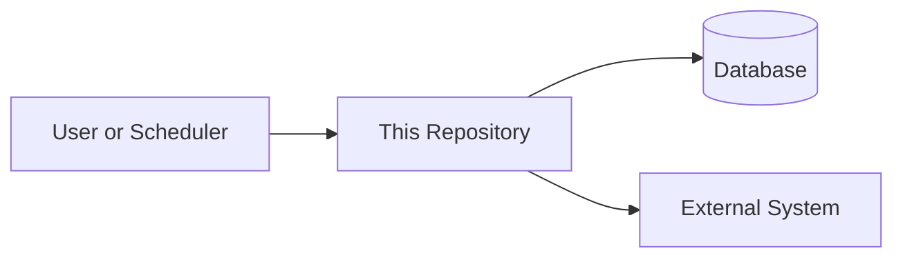
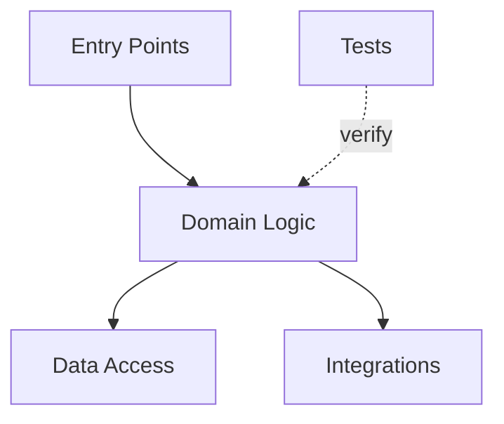
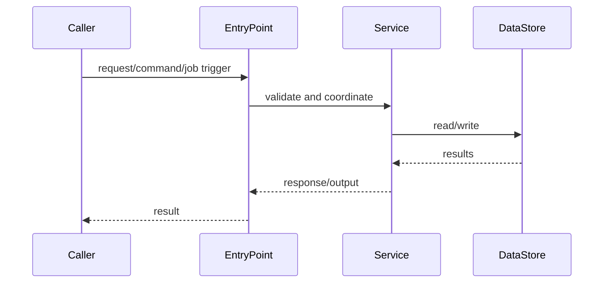
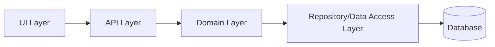
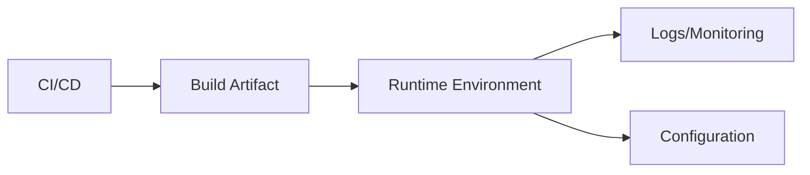

# Architecture Diagrams

> Diagrams should be small, readable, and grounded in repository evidence. Prefer several simple diagrams over one large diagram.

## Diagram Guidance

Include Mermaid diagrams only when they clarify the repository.

A diagram may be omitted when the repository is very small, such as a single script under roughly 200 lines, and the diagram would add more noise than value.

## 1. System Context

Use this diagram to show how the repository interacts with users, systems, databases, queues, files, and external services.

Explain the diagram in 2-5 sentences and cite the files or configs that support it.

## 2. Component or Module View

Use this diagram to show major packages, apps, or modules and their responsibilities.

Explain the most important dependency direction.

## 3. Request, Job, or Data Flow

Use this diagram to show the most important runtime path.

Explain the main flow and where errors are handled if visible.

## 4. Dependency Direction

Use this when dependency boundaries matter.

Explain whether the current dependency direction appears clean, mixed, or unclear.

## 5. Runtime and Deployment View

Use this when deployment, runtime, or operations are visible in the repo.

Explain what is known and what requires human validation.
